# Описания результатов квиза "Какой ты город?"

> Формат: короткое описание личности для экрана результата.
> Тон: личный, немного ироничный, без осуждения.

---

## 🇱🇰 Велигама

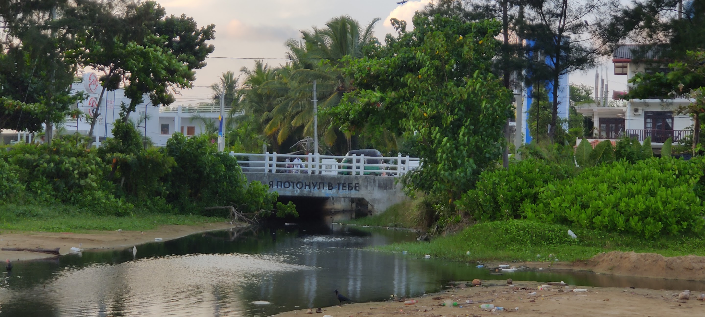

Ты именно тот, кто может доедать последний хуй без соли — и при этом спокойно заказать самое дорогое блюдо из меню. Несостыковки в твоей жизни существуют, но вопросов к ним ни у кого не возникает (у тебя тоже не возникает, естественно), потому что это как-то всё равно органично складывается. Проблемы завтрашнего дня — это проблемы завтрашнего тебя. Сегодня слишком хорошо, чтобы об этом думать.

---

## 🇹🇷 Стамбул

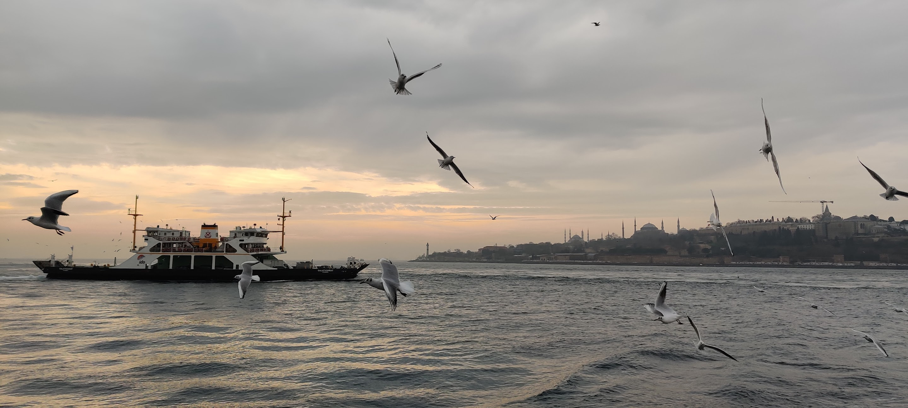

Люди, которые с тобой плохо знакомы, иногда думают, что ты просто никогда не слушаешь. На самом деле у тебя в голове происходит столько всего одновременно, что вопросы «как дела?» или «какие планы на вечер?» просто не успевают обработаться. На самом деле ты человек увлеченный и увлекающийся с набором очень специальных интересов — и не дай бог кому-то про них спросить. Но те, кому это подходит или кто случайно разделяет с тобой твои интересы от тебя уже никуда не денутся.

---

## 🇬🇪 Тбилиси

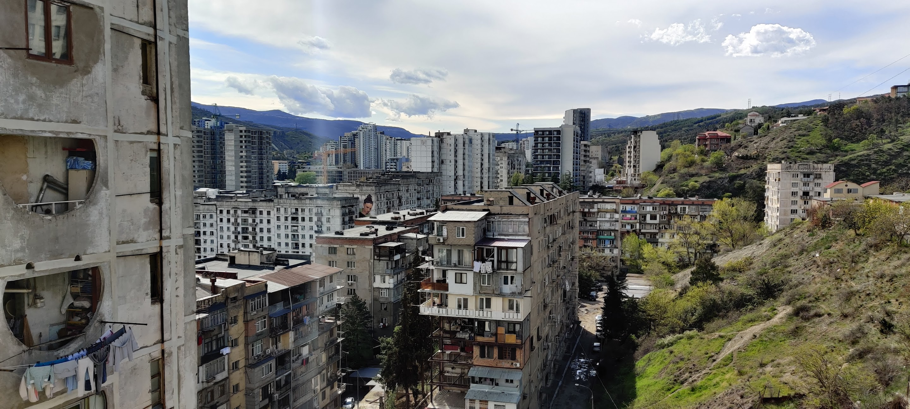

Со стороны ты выглядишь немного снобом — но это только потому, что ты сначала смотришь, а потом открываешься. Те, с кем ты хорошо знаком, понимают: ты один из самых общительных людей в комнате. Просто это надо заслужить. Ты комфортик и плюс вайбик (г-спди прости) — но показывать это будешь только своим.

---

## 🇬🇪 Батуми

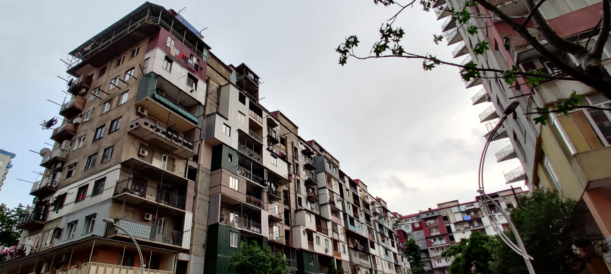

Ты живёшь в режиме «как-нибудь получится» — и, странным образом, получается. Твой modus vivendi, да и operandi тоже — «срала, мазала, лепила» (без негатива!). У тебя внутри какой-то постоянный штиль, и это немного раздражает тех, у кого его нет.

---

## 🇦🇲 Ереван

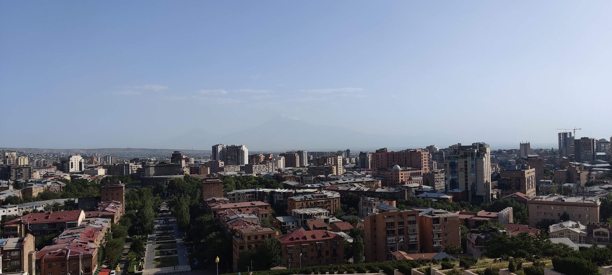

Ты говоришь «нормально» таким тоном, что сразу понятно — имеется в виду что-то другое. Да и вообще, ты на любителя. Но все мы тут на любителя, мы не $100, ясно вам? Ты пережил достаточно, чтобы не паниковать по мелочам. А уж тех, кто тебя не любит, ты точно переживёшь. Не нравится? Вас тут никто не держит.

---

## 🇷🇺 Москва

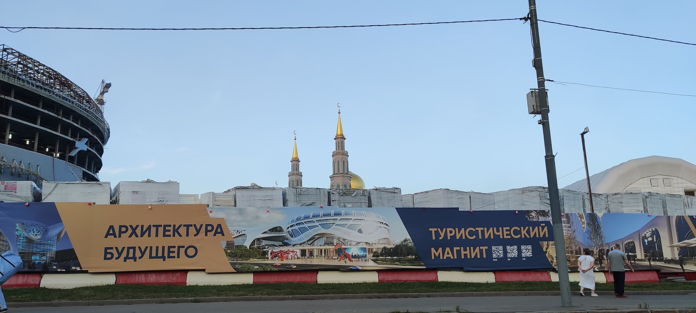

Ты знаешь, как должно быть — и именно поэтому тебя всё бесит. Не потому что плохо, а потому что ты помнишь, как было хорошо. «Нормально» в твоём исполнении — это целая философия. Но ты, конечно, сильно позврослел и резко изменился. Иной раз вообще непонятно, кто ты такой, но ты и сам наверное это замечаешь (а может тебе это замечает кто-то другой?). Но иной раз посмотришь на тебя — а ты всё такой же как раньше. Что же с тобой случилось, дружочек?

---

## 🇲🇪 Будва

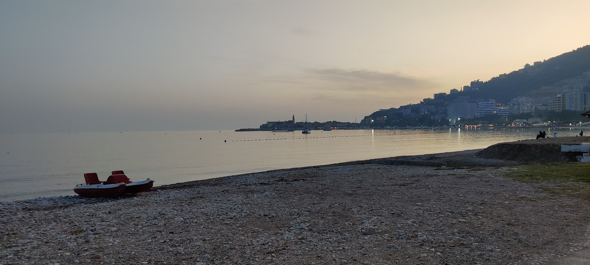

У тебя нет ни одной проблемы, и это не потому что ты их все решил. Ты медленный, немного ленивый и при этом совершенно доволен. В этом баре нормальное пиво стоит треть твоей зарплаты? Ну и что. Всё равно приду снова. Ты не игнорируешь проблемы — ты просто не считаешь их проблемами.

---

## 🇷🇸 Белград

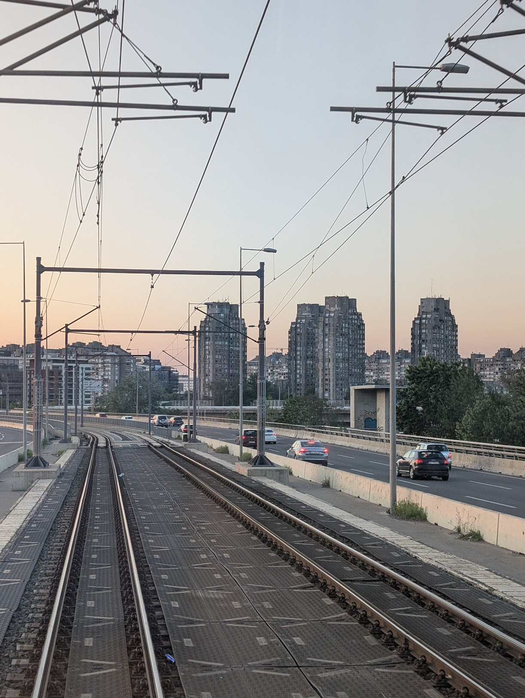

Тебя надо немного расшевелить — но как только это случилось, ты уже на волне. Ты пережил всякое, переварил, и теперь просто живёшь. У тебя за спиной есть история, которую ты не забыл, но и не таскаешь с собой как груз. Оттерапевтировался что ли? Ну, молодец, хвалим (точнее валидируем)!

---

## 🇰🇬 Бишкек

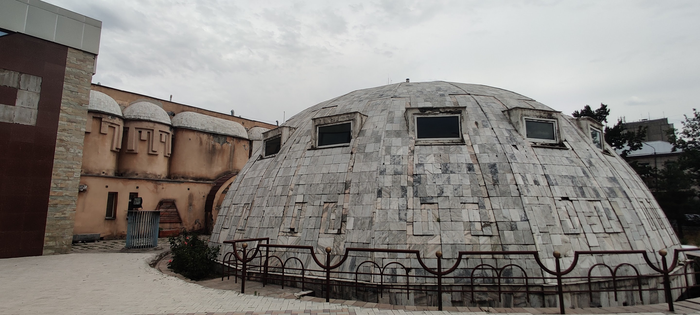

Ты обычный парень, без выпендрёжа и понтов. Немного грубоватый, немного неуклюжий. Но за большим столом ты свой, да ты походу вообще везде свой, тебя понимают без слов. Зачем тебе какой-то план, если есть плов.

---

## 🇪🇸 Мадрид

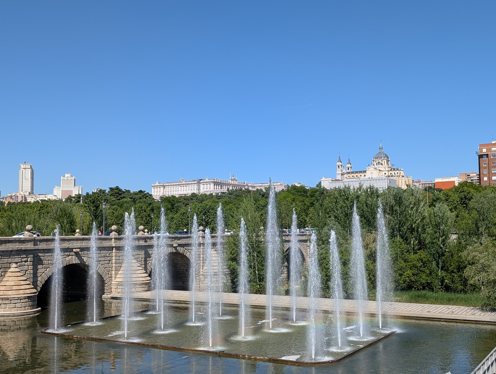

Ты отличный хост и требовательный гость. Всё должно быть по-твоему — и это оправдано, потому что у тебя действительно лучше. Ужинать в 22:00? Это не поздно, это правильно. Ты модный, громкий, почти безупречный — и совершенно не планируешь меняться ради тех, кто не разобрался.

---

## 🇲🇦 Агадир

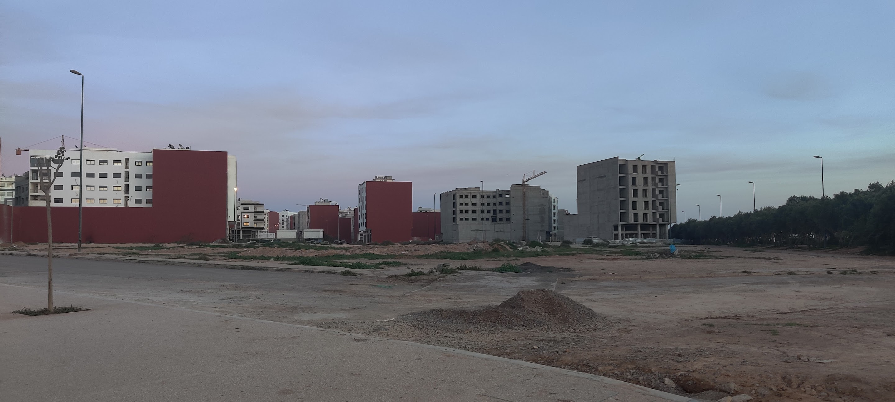

Братан, тебя нормально так помотало! Где ты был? Что с тобой случилось? Откуда этот прикид? Ладно, давай по порядку: ты уже как будто пришёл в себя, ты уже даже почти выглядишь, как человек! Расслабься, отдышись, прокашляйся — всё нормально будет.

---

## 🇩🇪 Берлин

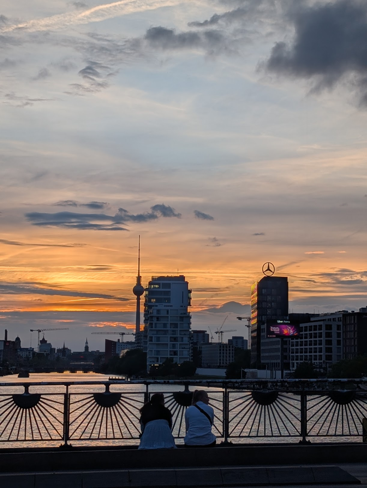

Ты объяснишь, почему опоздал на три часа — и при этом будешь прав. Ты стоишь в очереди в клуб с десяти вечера (уже светает), но официальная жалоба на шум уже подана. Всё это одновременно — и тебе самому кажется, что это логично. Ты на велосипеде, в секонде, с оформленным договором аренды на 25 лет. У тебя всё под контролем. У тебя действительно всё под контролем?

---

## 🇬🇧 Лондон

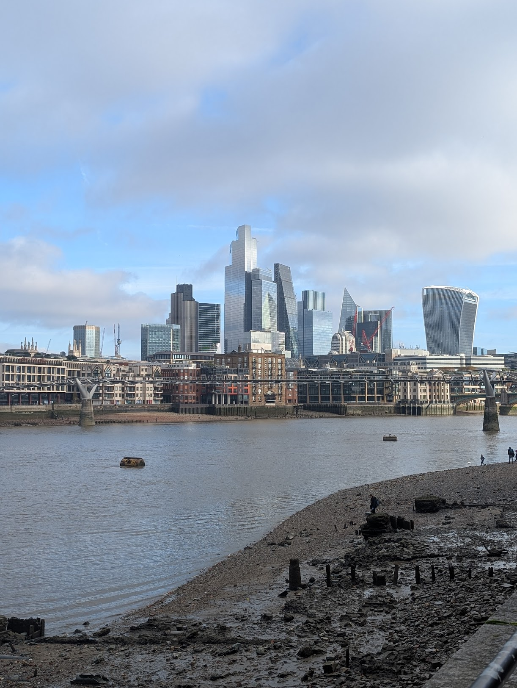

Ты умеешь поговорить ни о чём так, что это кажется важным разговором. Ты знал на что шёл — и цены не стали сюрпризом. Визу ты ждал полгода, документы собирал ещё дольше, и если честно — оно того стоило. Или нет. Но ты не скажешь, потому что это уже не вписывается в формат смолл-тока.

---

## 🇿🇦 Кейптаун

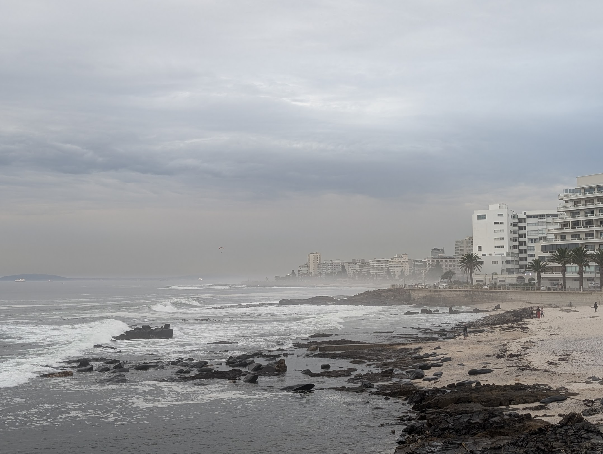

Ты из тех, кто красиво живёт с пониманием, что в любой момент может что-то случиться. Это не тревожность — это реализм. Ты заряжаешь телефон заранее, знаешь обходные маршруты, читаешь обстановку — и при этом искренне любуешься закатом. Тебя пугали, но ты приехал и остался.

---

## 🇦🇹 Вена

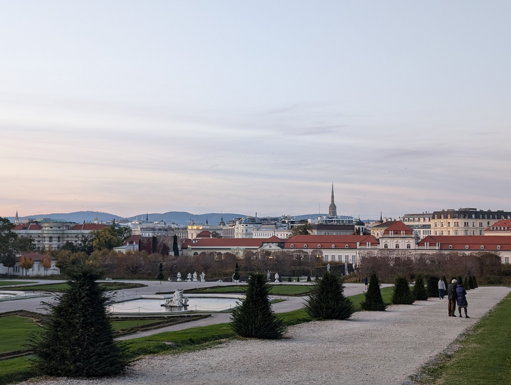

Ты живёшь правильно. Договор подписан, маршрут выверен, жалоба уже в трёх экземплярах. Ты не скучный — ты просто знаешь, как надо. Коктейль за 30 евро? Логично, ты так и рассчитывал. У тебя холодно и ветрено или жарко и ветрено, но это закаляет. И вообще ты культурный человек. Главная твоя проблема в том, что все вокруг недостаточно стараются.

---

## 🧸 Слонёнок Егор

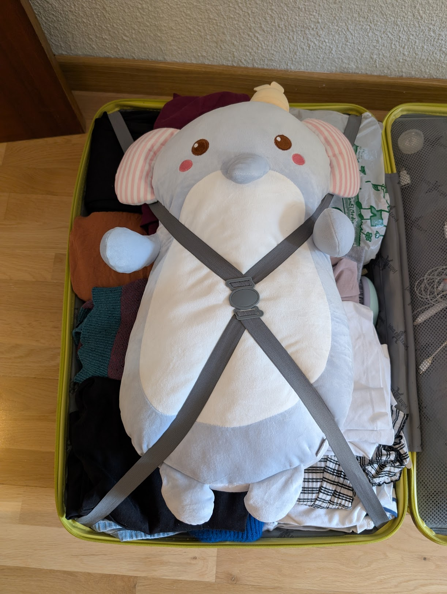

Тебя везут. Ты не знаешь куда. Тебя это совершенно не беспокоит — потому что ты Слонёнок Егор. У тебя нет документов, нет плана, нет мнения о пятничном вечере, но тебе ничего из этого не нужно. У тебя есть кто-то, кто тебя любит достаточно, чтобы тащить с собой везде (пусть даже в вакуумном пакете). Это, пожалуй, лучший результат из всех.
